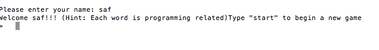
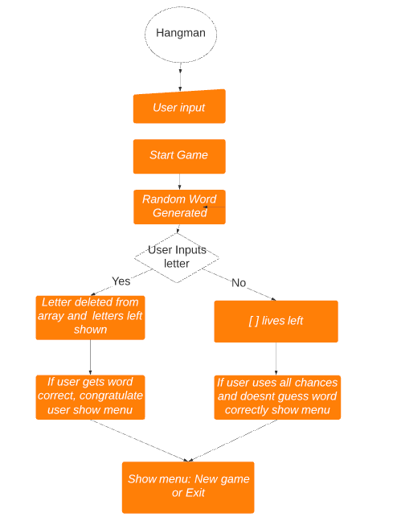

# Trello board 
- https://trello.com/b/ofSAQIUH/tasks

# Provide a link to your source control repository	
- https://github.com/safiyaaideed/terminalapp.git

                                                                                                                                         

# SOFTWARE DEVELOPMENT PLAN
# Develop a statement of purpose and scope for your application. It must include:
- describe at a high level what the application will do
- identify the problem it will solve and explain why you are developing it
- identify the target audience
- explain how a member of the target audience will use it

The application will randomly generate a word and the user has to guess the word, the user will have 5 chances to guess the word incorrectly then the game will end afterwards. The target audience for the game is anyone who visits my github, this could be my peers, educators or future employers. The target audience will use this as a fun interactive and educational game.

# Develop a list of features that will be included in the application. It must include:

This game contains a variation of features including a start game option and a new game/quit option. You are able to write your username as well.

# a username input feature, 

The username input was used as an interacative feature to personalise the game for each player.

# a welcome message 
As soon as you enter the game, you will be told to write your name or username. Once you type in your name there will be a welcome message before you start the game.

# a 'start' feature 

Type start to begin the game and the array will b

# a 'new game' and 'end game' feature.

# Note: Ensure that your features above allow you to demonstrate your understanding of the following language elements and concepts:
- use of variables and the concept of variable scope.
- loops and conditional control structures
- error handling

I would like the hangman game to be a very interactive game, I would like for it to have a start, exit and new game feature. The words used will probably be programming terminology that is frequently used to make it more interactive for the educators/students.

# Develop an outline of the user interaction and experience for the application.
Your outline must include:
- how the user will find out how to interact with / use each feature
- how the user will interact with / use each feature
- how errors will be handled by the application and displayed to the user

With each feature, there are specific instructions that will be written on screen for the game, it tells the user how to interact with each feature and how to go back tpo the main screen once completed.

# Develop a diagram which describes the control flow of your application. Your diagram must:
- show the workflow/logic and/or integration of the features in your application for each feature.
- utilise a recognised format or set of conventions for a control flow diagram, such as UML.

 

# Develop an implementation plan which:
- outlines how each feature will be implemented and a checklist of tasks for each feature
- prioritise the implementation of different features, or checklist items within a feature
- provide a deadline, duration or other time indicator for each feature or checklist/checklist-item

Utilise a suitable project management platform to track this implementation plan

> Your checklists for each feature should have at least 5 items.
 

 # Design help documentation which includes a set of instructions which accurately describe how to use and install the application.

You must include:
- steps to install the application
- any dependencies required by the application to operate
- any system/hardware requirements

- Hello and Welcome to Hangman!

To start this game you must first type in 'play.rb' into your terminal, you then have a set of instructions that pop up. Enter your username and type start and press enter. The game will randomly generate a word, you guess each letter and the game will promt you if you are either correct or incorrect. Once the word is guessed it will go to the main menu which will give you the option to either quit or start a new game.